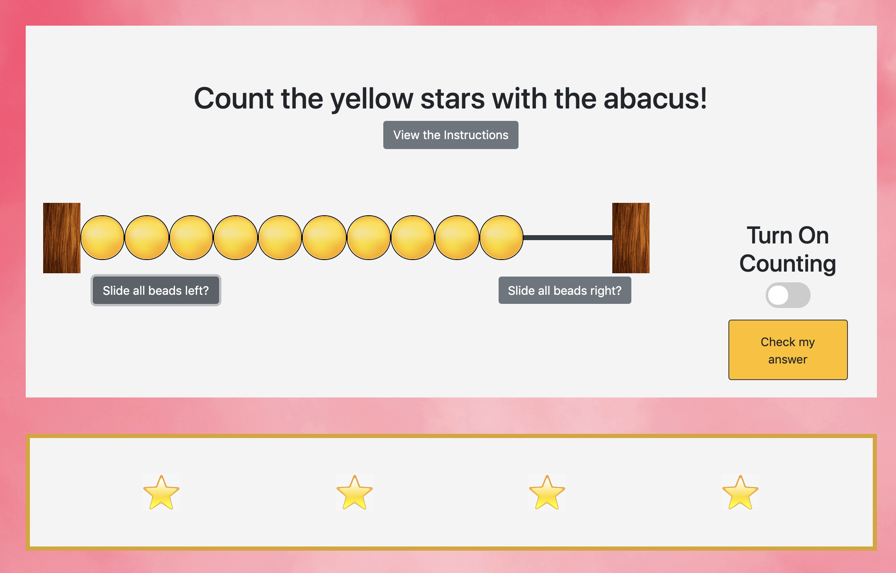

# Numbers
An app to display numbers in different representations for children featuring games to help children develop mathematical thinking. Users will work on counting 0-10 using both objects, an abacus, and an audio and visual representation of each numeral as they count. 

## Functionality 

### Customization
Before entering the game, users are asked to fill out a form which provides thier name, favorite animal, favorite color, and item that they want to count. The inputs are used to customize the game appearance based on user preferences. 

#### Favorite Animal and Giphy
The favorite animal input is used in an api call to Giphy. It provides a gif image of the animal when users solve the level. 

#### Favorite Color
The favorite color input is used to pick a background color for the webpage. 

#### Counting Item
The preference on counting item is used to pick which image appears on the screen for users to count.  

### Game Play
This application works as a game to test children's ability to count from zero to ten. Instructions are available on click of the instruction button. When users click the "Check my answer" button, the game will determine whether they successfully counted the objects and represented it on the abacus. If they were successful, the counting stars will spin out of the screen and a new level will appear. Otherwise they will be allowed to try again on the current level. 

### Abacus

#### Moving individual beads
The abacus is customly coded using a bootstraps grid to create 12 columns for the beads to move in. Each counter bead has an event listener that will determine whether the bead is on the outside edge has room to move. If it can move, the function determines where to move it and then animates the bead sliding to its new location. After a timed interval, the actual html of the bead will be moved to the new location and it's location status will be updated. A new bead cannot be clicked on until this process has finished. 

#### Moving all beads
Users can also move all beads to the right of the left. Functions were created to determine which beads are not already in the desired position, and then move those in a similar fashion as moving an indivual bead. It moves each indvidual bead in a timed interval until all beads are on the desired side.

### Counting- audio/numerals
Users can turn on and off the counting capability of the app. While on, the app counts with the movement of the abacus beads to help user's understand how an abacus works. The count includes an audio file of the number being said along with a visual depiction of the numeral on the screen. 

### Random Level Creation
When the game loads or when a new level is created, the app randomly generates a number from one to ten, then creates and appends the star images into the container element on the screen. 

### Mobile First Responsive Design
This appliation is designed to be used on any device!

## Coding

*   This project utilizes javascript and css.
*   Bootstraps 4 is utilized for the styling and for media responsiveness as well as creating the modals.
*   jQuery selects and mainpulates the DOM. 
*   Animate.css is responsible for the animation of the counting stars when they disappear from the screen. 
* Local storage stores form input
* Giphy's API is called using AJAX and supplies a customized gif

## Meta 

Jamie Kook - kookjc6@gmail.com

[https://https://jamiekook.github.io/Numbers](https://jamiekook.github.io/Numbers)
